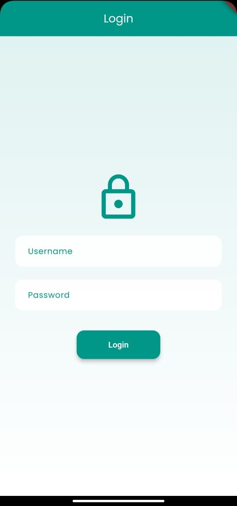
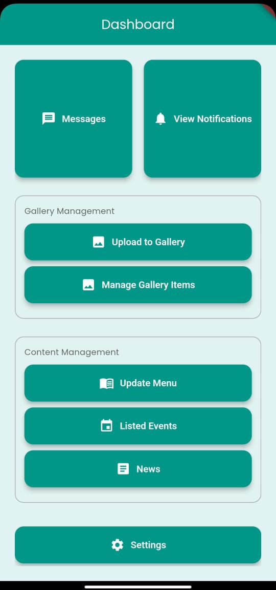
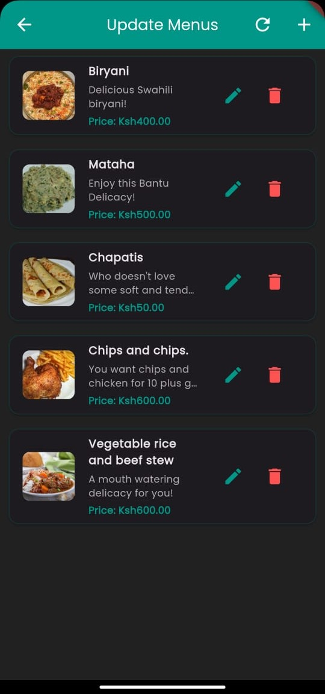

# DTC Content Manager

DTC Content Manager is a Flutter-based mobile application built for *Delicious Tumaini Caterers (DTC)*.

It acts as a lightweight Content Management System (CMS) that enables the catering business' administrators to effortlessly manage and update website content directly from their mobile devices.

This project was built with a focus on simplicity, performance, and usability — empowering non-technical staff to maintain an up-to-date and engaging online presence.

---

## Features

### Admin Capabilities:
- 📸 Upload and manage gallery images (food photos, event highlights).
- 📰 Create, edit, and delete news articles.
- 📅 Post and manage upcoming events.
- 🍽️ Manage menu items and food categories.
- 📩 View website contact form submissions.
- 🔔 Receive real-time notifications for new inquiries.

---

## Tech Stack

| Technology | Purpose |
|------------|---------|
| Flutter    | Cross-platform mobile development. |
| GetX       | State management, routing, and dependency injection. |
| REST API   | (Connected to backend for content management). |

---

## Screenshots

| Login Screen                              | Dashboard                             | Menu Update                               | Messages                            |
|-------------------------------------------|---------------------------------------|-------------------------------------------|-------------------------------------|
|  |  |  | |

---

## Getting Started

### Prerequisites
- Flutter SDK installed
- Emulator or physical device for testing
- Backend API / Database ready for content management

---

### Installation Steps

```bash
git clone https://github.com/EdiGich/dtc_content_manager.git
cd dtc_content_manager
flutter pub get
flutter run
```

### Author
Built with ❤️ by [Edwin Gichira](https://www.linkedin.com/in/edwin-gichira-9147a8213/)


Flutter Developer | UI/UX Enthusiast | Passionate about building real-world solutions.

### License
This project is for educational and portfolio purposes.
